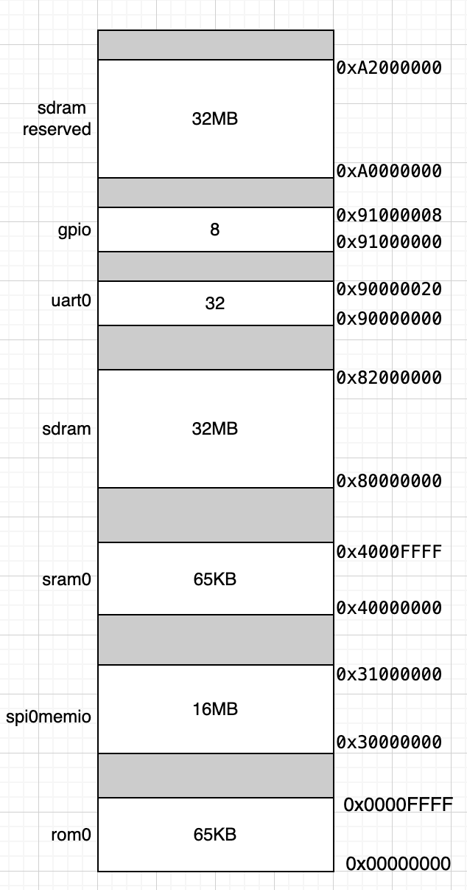

# Simple RISC-V SoC

This repository contains a basic SoC desing using a picorv32 core. This repository is an updated version from the original repository available [here](https://github.com/open-design/riscv-soc-cores.git). This repository now works with using fusesoc 2.4.3 using the latest CAP2 configuration specifications. 

The current repository has been proven on the Altera DE1 and DE10-nano boards. 


## System architecture. 

The minimal SoC is composed of a nanorv32 RISC-V processor interconected with several memoery mapped peripherals. The following figure depicts the addresable memory space for each peripheral. 




## Simulation:

```bash
conda activate fusesoc

fusesoc --cores-root cores/ run --target sim picorv32-wb-soc

gtkwave build/picorv32-wb-soc_0/sim-icarus/picorv32-wb-soc.vcd
```

## Build for DE1 Board

```bash
conda activate fusesoc
export PATH=$PATH:/path/toquartus/13.0sp1/quartus/bin
fusesoc --cores-root cores/ run --build --tool quartus de1-nanorv32-wb-soc
```

## FPGA Program 

```bash
./jtagconfig
quartus_pgm  -m jtag -o "p;build/de1-nanorv32-wb-soc_0/default-quartus/de1-nanorv32-wb-soc_0.sof"
```

## Booting a sw application using NMON 

```bash
cd sw/blink_led
make clean nmon
./nmon-loader.sh application.nmon /dev/ttyUSB 115200
```

if you want to terminate the terminal session after programming the SOC, press `~-` followed by the return key.
