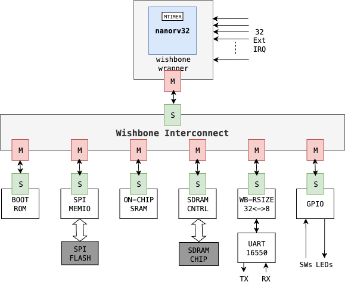
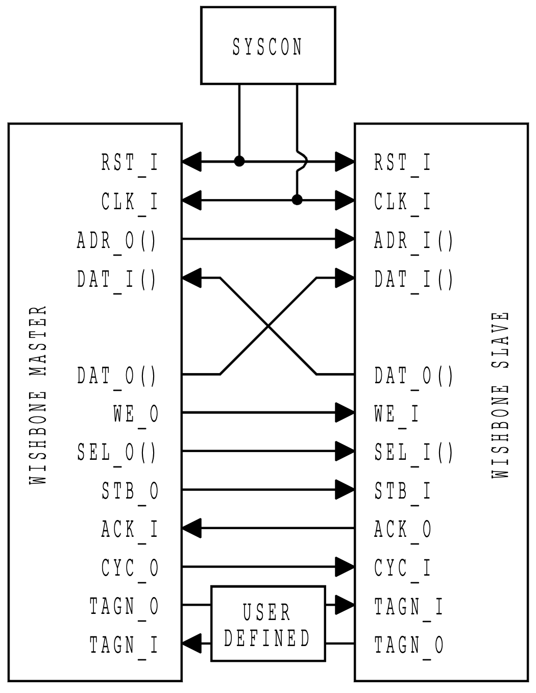
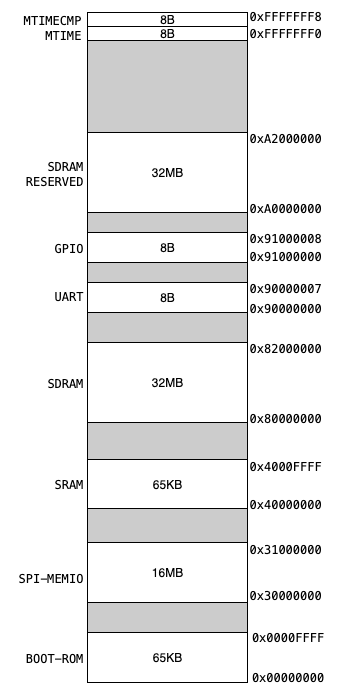
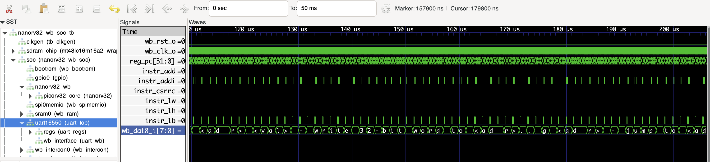

# Simple RISC-V SoC
This is an educational SoC based on an small risc-v core. The SoC correspinds to an updated version from the [risc-soc-cores](https://github.com/open-design/riscv-soc-cores.git). In particular, the SoC incorporates the usage of [nanorv32](https://github.com/elvisfox/nanorv32.git) core instead of the original [picorv32](https://github.com/YosysHQ/picorv32.git) core. The nanorv32 core includes the CSR RISC-V ISA specifications to support interrupts and exceptions instead of the customized exceptions handler provided by picorv32. On top of nanorv32, we included support for R/W of the `mtvec` register allowing the trap vector relocalization by software rather than the fized by hardware as the original nanorv32 implementation. 

The SoC implementation is handled using fusesoc 2.4.4 according to the CAP2 specifications, check the [fusesoc documentation](https://fusesoc.readthedocs.io/en/stable/) for more information.

The `nanorv32-wb-soc` has been proven on the Altera DE1 and DE10-nano boards. 

##  NanoRV32-wb-SoC: System Architecture
The SOC's system architecture is composed of different components or cores interconected troughout the wishbone bus interconection. The general overview of the SoC is depicted in the following figure. The nanorv32 core is the master (`M`) of the system, while the IP cores correspond to the (`S`)slaves in the WB system. In particular, the system includes six IP cores, however it can be customized adding or removing more IP cores.

- **BOOT-ROM**: Corresponds to and on-chip read-only memory that can be used to allocate a basic bootloader or initialization program. The `nanorv32-wb-soc` uses a modified version of [RISC-V NMON](https://github.com/frantony/riscv-nmon.git). 
- **SPI-MEMIO**: An on-chip controller for accesing external FLASH memories trough SPI interface. 
- **ON-CHIP SRAM**: Up to 65KB of chip SRAM memory that can be used both for storing intructions and data.
- **SDRAM CNTRL**: An SDRAM controller for accesing external Synchronous Dynamic RAM chips. The current implementation supports the SDRAM chips available in the Terasic boards such as DE1 and DE0-Nano. 
- **UART16550**: AN UART IP according to the the 16550 specifications, allowing serial interconnection with other systems.
- **GPIO**: AN exteral interface for connecting digital inputs (e.g., Switches) and outputs (e.g., LEDs) or any other components. 



The Whishbone B4 specification determines the interconection and the Write/Read transactions happening in the bus. You can refer to the Whishbone [documentation](https://cdn.opencores.org/downloads/wbspec_b4.pdf) for deeper details. You can also refer to this interesting blog about the [Whishbone behavior](https://zipcpu.com/zipcpu/2017/11/07/wb-formal.html). In summary, the following figure depicts the ports and specification's interconnections for both the Master and Slave under the WB specifications.



## NanoRV32-wb-SoC: Memory Map
In any bus specifications, including Whishbone, all cores are required to be addresable, in this way any Bus Master (e.g., processor) can specifically access or "talk" with any peripheral. 

In this regard, the `nanorv32-wb-soc`, in its current implementation follows the following Memory-Map. In the lower addresable space the **BOOT-ROM** can be accessed. In fact, after a hard-reset the `nanorv32` points ot the address `0x00000000`, hence this memory should allocate the entry program in the system. It is important to underlyne that by default, the **BOOT-ROM** is initialized with [**NMON**](./sw/0-riscv-nmon/nmon_nanorv32-wb-soc_24MHz_115200.S) a simple monitor for RISC-V cores that permits a UART-based interaction for basic I/O, including bootloader capabilities using serial through serial comunication.

Likewise, the rest of the cores are assigned to different memory locations as follows: 

- SPI-MEMIO:
    - BASE_ADDRESS: 0x30000000
    - SIZE: 16MB
- SRAM:
    - BASE_ADDRESS: 0x40000000
    - SIZE: 65KB
- SDRAM:
    - BASE_ADDRESS: 0x80000000
    - SIZE: 32MB
- UART:
    - BASE_ADDRESS: 0x90000000
    - SIZE: 8B
- GPIO:
    - BASE_ADDRESS: 0x91000000
    - SIZE: 8B
- SDRAM-RESEVED:
    - BASE_ADDRESS: 0xA0000000
    - SIZE: 32MB

In Addition, the `nanorv32` core has an internal MM timer (MTIME and MTIMECMP) which is not connected to the Whishbone bus. In such a case the MM specifications are the following ones:

- MTIME:
    - BASE_ADDRESS: 0xFFFFFFF0
    - SIZE: 8B
- MTIMECMP:
    - BASE_ADDRESS: 0xFFFFFFF8
    - SIZE: 8B




## NanoRV32-wb-SoC: Preparation

In order to use the `nanorv32-wb-soc` you need to install some packages and tools. Here the requirements:

### System requirements
- Linux system X-86 (e.g., ubuntu 22.04): (it can be used in a virtual machine or using the WSL for windows)
- Miniconda or Anaconda: Here instalation [instructions](https://www.anaconda.com/docs/getting-started/miniconda/install#linux-terminal-installer)
- Quartus II 13.0 SP1 Webedition: (You can keep it on windows if you already have it)
- OSS-CAD-SUITE: Here instalation [instructions](https://github.com/YosysHQ/oss-cad-suite-build)
- riscv64-unknown-elg-gcc toolchain

### Create a conda environmet and install fusesoc
1. Once you have installed all the necesary dependancies create the conda environment with fusesoc as follows:

    ```bash
    conda create -n fusesoc python=3.11
    conda activate fusesoc
    pip install fusesoc
    ```
2. Be sure you have cloned or pull the last commin of the current repository

    ```bash
    # if you haven't clone the repository type this command 
    git clone https://github.com/divadnauj-GB/UPTC-Teaching.git
    # if you already have the repository you can directly type this command whitin the repository
    git pull
    ```

## NanoRV32-wb-SoC: Simulation

In orde to simulate the default NMON execution of `nanorv32-wb-soc` foll

```bash
# change the directory into the riscv-soc-cores directory whiting the course repository
cd Computer-Architecture/2-RISC-V/hardware/riscv-soc-cores/
# activate the conda environment with fusesoc
conda activate fusesoc
# launch the simulation using the following command
fusesoc --cores-root cores/ run --target sim nanorv32-wb-soc-mtvec
# After running the simulation you will see the following message, indicating that you have at least the simulation tools working properly

nmon commands:
 q - quit
 d <addr> - read 32-bit word from <addr>
 w <addr> <val> - write 32-bit word to <addr>
 g <addr> - jump to <addr>
   use <ESC> key to interrupt current command

nmon> 
# After this you can open the waveforms using this command
gtkwave build/nanorv32-wb-soc-mtvec_0/sim-icarus/nanorv32-wb-soc.vcd 
```
After opening the waveforms you can add the signals you would like to inspect, in this example some random signals including the data sent by the uart are depicted. Feel free to interact whit the waves.



## NanoRV32-wb-SoC: Build the HW on FPGA (DE1-Board)
You can implement directly the `nanorv32-wb-soc` on the DE1 or DE10-nano boards. 

- If you have quartus installed on you linux system follow these instructions 

    ```bash
    conda activate fusesoc
     #you need to specify the path where quartus is installed 
    export PATH=$PATH:</path/to/quartus>/13.0sp1/quartus/bin
     #This will automatically create and compile the project in quartus II, generating the programing file for the FPGA
    
     #This command will take some time, after the compilation runs succesfully you will obtain the *.sof file in the "./build/de1-nanorv32-wb-soc-mtvec_0/default-quartus/" directory
    fusesoc --cores-root cores/ run --build --tool quartus de1-nanorv32-wb-soc-mtvec

     # connect your FPGA to the system and run the following command to detect the USB blaster JTAG chain
    jtagconfig

     # Program the FPGA device running the following command
    quartus_pgm  -m jtag -o "p;build/de1-nanorv32-wb-soc-mtvec_0/default-quartus/de1-nanorv32-wb-soc-mtvec_0.sof"
    ```

- If you do not have Quartus on your linux system but you have it on you Windows machine you can follow these instructions

   1. run the following command. This will show a failed error since quartus is not available, however it will create the necesary scripts to be run on Quartus under the following drectory: `./build/de1-nanorv32-wb-soc-mtvec_0/default-quartus/`

        ```bash
        conda activate fusesoc
        fusesoc --cores-root cores/ run --build --tool quartus de1-nanorv32-wb-soc-mtvec
        ```

    2. copy the full content of the directory `./build/de1-nanorv32-wb-soc-mtvec_0/default-quartus/` to your windows system

    3. open a windows terminal (powershell or equivalent), enter into the `./build/de1-nanorv32-wb-soc-mtvec_0/default-quartus/` directory and run the following command

        ```bash
        quartus_sh -t de1-nanorv32-wb-soc-mtvec_0.tcl
        ```
    4. This will create the Quartus project isnide the directory

    5. Open Quartus as grafical interface and load the generated project, then follow the usual instruction on Quartus, compile and program the FPGA


## NanoRV32-wb-SoC: NMON interaction 
Once you have programmed the SoC hardware on the FPGA, connect a USB-Serial adapter (e.g., ft2323 board). The UART peripheral of the `nanorv32-wb-soc` is physically connected to the GPIO0 of the Board. Connect the USB-SERIAL adapter as follows: 

### DE1 UART connection
-------------------------

    .------.
    | 1   2|  2 (GPIO_0[1]) fpga --> host
    | 3   4|  4 (GPIO_0[3]) fpga <-- host
    | .....|
    |    12| 12 (GND)
    |      |
    |      |
    |......|
    |      |
    |39  40|
    '------'
      GPIO0
-------------------------

conect the FT232 board to you pc and open a terminal, on linux you need just to run screen as follows:
NOE: If you do not have screen, ou can install it `sudo apt get install screen`

```bash
screen /dev/ttyUSB0 115200
```

NOTE: On windows you can use TeraTerm or Putty.

Press any key and you will get the following prompt from `nanorv32-wb-soc` in the FPGA. 

```bash
nmon commands:
 q - quit
 d <addr> - read 32-bit word from <addr>
 w <addr> <val> - write 32-bit word to <addr>
 g <addr> - jump to <addr>
   use <ESC> key to interrupt current command

nmon> 
```
Follow the command description in the promp to interact with the system: For example, read and write values to the address 0x40000000

```bash
nmon>  d 40000000
nmon>  d 00000000
nmon>  w 40000000 AAAAAAAA
nmon>  d 40000000
nmon>  AAAAAA
```

After you finishied to interact with the system type `CNTRL+A K` and then `Y`  for close the port. 


## NanoRV32-wb-SoC: Software examples

In this repository you will find some SW examples that can be programmed to the system. We use NMON for booting the applications. The list of programs can be found under the [SW](./sw/) directory in this repository. The following are the current list of programs tested on the platform: 

- [0-riscv-nmom](./sw/0-riscv-nmon/)
- [1-blink_led](./sw/1-blink_led/)
- [2-gpio_echo](./sw/2-gpio_echo/)
- [3-uart_stub_1](./sw/3-uart_stub_1/)
- [4-uart_stub_2](./sw/4-uart_stub_2/)
- [5-uart_puts](./sw/5-uart_puts/)
- [6-uart_getc](./sw/6-uart_getc/)
- [7-systmr-irq](./sw/7-systmr-irq/)
- [8-FreeRTOS-demo1](./sw/8-FreeRTOS-demo1/)
- [9-FreeRTOS-demo2](./sw/9-FreeRTOS-demo2/)

### Booting a sw application using NMON 
For loading and booting your application with NMON you need to install `expect`, you can simply type `sudo apt install expect`. 

For example enter into the `1-blink_led` directory and compile it and program the generated *.nmon file.

```bash
cd sw/1-blink_led
make clean nmon
expect nmon-loader.sh application.nmon /dev/ttyUSB 115200
```

if you want to terminate the terminal session after programming the SOC, press `~-` followed by the return key.
